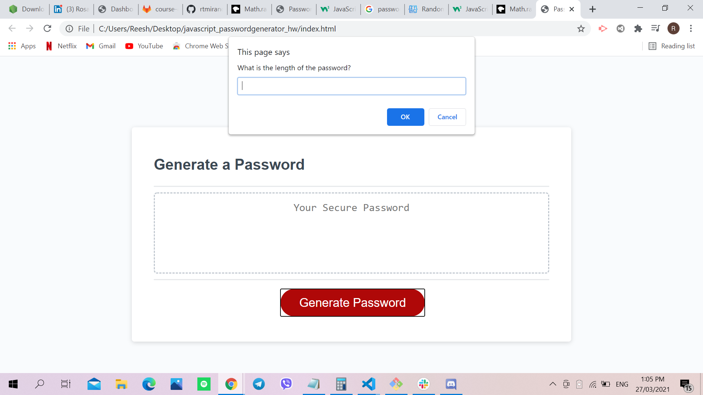

# Javascript Password Generator

## Site Picture


## Technologies Used
- HTML - creates elements on the DOM
- CSS - adds style to html elements
- Javascript - adds special effects on pages
- GitBash - for cloning repository and pushing code to GitHub
- GitHub - holds repository that deploys to GitHub Pages

## Summary
This file contains the webpage for a Password Generator. It also contains code that was created using HTML, CSS and Javascript. 

## Code Snippet
```html
function generatePassword(passwordLength){
  var length = window.prompt("What is the length of the password?");
  if (length < 8 || length > 128){
    alert("Try again. Choose within the limit.");
    return;
  }
  var lowCase = window.confirm("Are the letters lower case?");
  var capLet = window.confirm("Are the letter's capitalized?");
  var specChar = window.confirm("Are there any special charachters?");
  var number = window.confirm("Are there any numbers?")
}
```

```html
<html>

</html>
```

## Author Links 
[LinkedIn](https://www.linkedin.com/in/rosario-miranda-b81170132/)
[GitHub](https://github.com/rtmiranda18)
